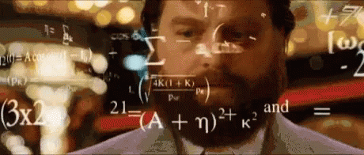

# Análise de Perfis com possíveis robôs
**Existe alguma forma de saber que tem exterminadores do futuro seguindo algum perifl? E vários deles?**
<h2 align="center">IronHack Final Project</h2>

## Status Projeto:
Em progresso

## Índice:
- [Resumo](#Resumo)
- [Curiosidades](#Curiosidades)
- [Benford](#Benford)
- [Aplicação](#Aplicação)
- [Processo](#Processo)
- [Resultado](#Resultado)
- [Author](#Author)

### RESUMO

Em um mundo onde as redes sociais passaram a ser fonte de informações, comércio, e padrões, páginas e perfis estão buscando popularidade a todo custo.
Um novo comércio nasce a partir disso, venda de perfis e seguidores na internet ganharam novas proporções.
Mas existe alguma maneira de descobrir que algum perfil utilizou esses robôs para ganhar novos seguidores?

### CURIOSIDADES 

Este projeto foi pensado a partir de um estudo da professora <a href="https://en.wikipedia.org/wiki/Jen_Golbeck">Jennifer Golbeck</a>, professora da Universidade de Maryland.
Ela fez um pesquisa em como a Lei de Benford seria aplicada e retornaria informações sobre as redes sociais.
Um episódio de um documentário chamado a Era dos Dados menciona o estudo realizado por ela. Pra ser mais exato o episódio 4.

### BENFORD

<a href="https://en.wikipedia.org/wiki/Benford%27s_law">Lei de Benford</a>,também conhecida como Lei dos Primeiros Dígitos ou Fenômeno da
Dígitos Significativos, é a constatação de que os primeiros dígitos do números encontrados em séries de registros das mais variadas fontes fazem
não exibem uma distribuição uniforme, mas sim são organizados em tais uma forma em que o dígito "1" é o mais frequente, seguido por "2",
"3", e assim de forma sucessiva e decrescente até "9", que apresenta a frequência mais baixa como o primeiro dígito.
Como o primeiro dígito de qualquer número pode variar de "1" a "9" (não considerando "0"), seria intuitivamente esperado que o
proporção de cada ocorrência em um conjunto de registros numéricos seria ser uniformemente distribuído em 1/9, ou seja, aproximadamente 0,11111,
ou 11,11%. Mas não é isso que acontece conforme a Lei de Benford.

Ok, a professora estudou, existe uma explicação sobre como funciona, mas o que Benford ajuda a descobrir se existe robos em determinados perfis?

## APLICAÇÃO

Basicamente a Lei de Benford é aplicada em um quantidade de dados diversas, e que não tenha padrões estreitos. Como a altura de todos os cidadão de uma cidade.
Mas para as redes sociais ela se aplica, para saber se um determinado perfil possui robôs, são necessários os dados referente ao perfil que deseja.
E extrair os dados de seguidores que seguem este perfil, os primeiros dígitos desta raiz de dados se encaixará dentro da Lei de Benford.
Veja, neste caso não demostra quais são os perfis que possivelmente são os bots/robôs. Mas destaca se o perfil cabe uma análise melhor ou não.

## PROCESSO
1. Verificação de dados possíveis via API da rede social
2. Utilização de métodos para captação de dados via API, ou Scraping via Selenium e BeautifulSoup;
3. Ordenação de dados e estudo de bibliotecas necessárias;
4. Visualização de dados;
5. Análise de padrões;
6. Clusterização para busca de padrões sobre análise descritiva. (A ser implementado)

## RESULTADO

## Learning Process
### Theory Applied
- [x] Pandas  
- [x] Numpy 
- [x] Selenium 
- [x] BeautifulSoup 
- [x] Benford_Py 
- [x] WebScraping  
- [ ] Clusterização 

### MELHORIAS
- Procurar formas de captação de dados mais rápida
- Aumento de captação de dados

### APRESENTAÇÃO

- <a href="https://drive.google.com/file/d/1q8-2ZN7VcGTz1j6knSK-woAD2H-UqMf2/view?usp=sharing"> Clique aqui </a>

### AGRADECIMENTOS

Raiana Rocha e Guilherme Cuzner

## AUTOR
César Ribeiro
